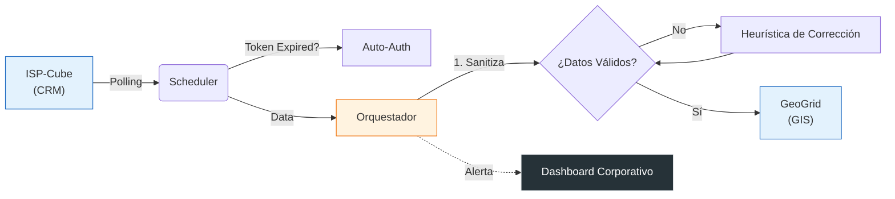

# Orquestador Intercity – Ingeniería en Telecomunicaciones

**Trabajo Final de Prácticas Profesionales**

Este repositorio alberga el código fuente y la documentación técnica del **Orquestador Intercity**, un middleware ""Enterprise-Grade"" desarrollado para la automatización crítica de procesos de aprovisionamiento FTTH. El sistema actúa como puente lógico inteligente entre el Business Support System (BSS) **ISP-Cube** y el sistema de gestión geoespacial (GIS/OSS) **GeoGrid**.

---

## 1. Resumen Ejecutivo

El objetivo principal es eliminar la carga operativa manual y los errores humanos en la gestión de infraestructura de red. Mediante una arquitectura orientada a eventos, el sistema no solo sincroniza datos, sino que **asegura la integridad y calidad** de los mismos, aplicando reglas de negocio complejas y corrección automática de anomalías.

**Funcionalidades Clave:**
*   **Sincronización Inteligente:** Propagación bidireccional de altas y bajas (Decommissioning) con manejo de estados intermedios.
*   **Aprovisionamiento Lógico Automatizado:** Asignación de puertos PON y documentación de acometidas (Drops) georreferenciadas.
*   **Self-Healing de Datos:** 
    *   Corrección automática de coordenadas malformadas (-33105847 → -33.105847).
    *   Recuperación automática ante caídas de servicios externos (Circuit Breakers).
    *   Refresco autónomo de tokens de autenticación vencidos.
*   **Interfaz de Operación "Enterprise":** Dashboard profesional sobrio (Dark Mode) para monitoreo de incidentes y métricas de negocio en tiempo real.

---

## 2. Arquitectura del Sistema

El proyecto implementa una **arquitectura de microservicios contenerizada**, diseñada para alta disponibilidad y mantenibilidad.

### 2.1 Estructura Modular (Clean Architecture)
El código sigue una estricta separación de responsabilidades:
*   **`orchestrator.core`**: Infraestructura base, manejo de configuración y resiliencia HTTP.
*   **`orchestrator.logic`**: Reglas de negocio puras, desacopladas de frameworks y transporte.
*   **`orchestrator.services`**: Adaptadores para APIs externas (ISP-Cube, GeoGrid).
*   **`orchestrator.api`**: Capa de presentación REST (FastAPI).

### 2.2 Componentes de Despliegue (Docker Compose)
| Servicio | Rol | Descripción |
| :--- | :--- | :--- |
| **`orchestrator`** | Backend | Núcleo de lógica de negocio (FastAPI, Python 3.11). |
| **`scheduler`** | Cron Jobs | Ejecutor de tareas asíncronas (Polling, Reintentos, Limpieza). |
| **`ui`** | Frontend | Panel de control profesional (Streamlit) para visualización de estado. |
| **`prometheus`** | Métricas | Recolector de series temporales. |
| **`grafana`**  | Dashboards | Visualización avanzada de KPIs técnicos. |

---

## 3. Flujo de Información y Resiliencia

El sistema opera bajo un modelo de **consumidor inteligente** con capacidad de autosanación:

1.  **Detección:** El *Scheduler* consulta periódicamente ISP-Cube. Si el token expiró, **se auto-renueva** sin intervención, garantizando continuidad operativa.
2.  **Validación & Corrección (Sanitización):** 
    *   Antes de procesar, se validan los datos geográficos.
    *   Si se detectan coordenadas fuera de rango (ej. error de tipado o formato entero), el sistema aplica heurísticas matemáticas para **normalizarlas automáticamente**.
3.  **Ejecución Transaccional:**
    *   Se impacta en GeoGrid solo si todas las precondiciones se cumplen.
    *   En caso de fallo técnico (timeout), se encola para **reintento exponencial**.
    *   En caso de fallo de negocio (datos inválidos), se genera un **Incidente** visible en la UI.



---

## 4. Estándares de Ingeniería

Para garantizar la robustez necesaria en un entorno crítico de telecomunicaciones:

*   **Clean Code:** Tipado estático estricto (Type Hints), Pydantic para validación de contratos y manejo de excepciones granular.
*   **Observabilidad Completa:** Cada transacción genera logs estructurados, trazas de auditoría y métricas Prometheus.
*   **Seguridad:** Manejo de secretos vía variables de entorno (`.env`), sin credenciales hardcodeadas.
*   **UI Profesional:** Interfaz diseñada con principios de **Minimalismo Corporativo** (Inter font, Paleta Dark Enterprise), optimizada para operadores de NOC.

---

## 5. Instalación y Puesta en Marcha

El sistema es **agnóstico del entorno** y listo para despliegue ("Portable").

### 5.1 Requisitos
*   Docker & Docker Compose.
*   Credenciales válidas de los sistemas externos.

### 5.2 Despliegue Rápido
1.  Clonar el repositorio.
2.  Copiar `.env.example` a `.env` y configurar credenciales.
3.  Iniciar:
    ```bash
    docker compose up --build -d
    ```

### 5.3 Accesos
*   **Dashboard Operativo:** [http://localhost:8501](http://localhost:8501)
*   **API Docs:** [http://localhost:8000/docs](http://localhost:8000/docs)
*   **Métricas Gráficas:** [http://localhost:3000](http://localhost:3000)

---

## 6. Autoría

**Proyecto de Ingeniería de Software Avanzada**
Desarrollado como parte de las Prácticas Profesionales de **Manuel Magallanes**.
*Ingeniería en Telecomunicaciones*

---
*© 2026 Intercity Telecomunicaciones - Todos los derechos reservados.*
